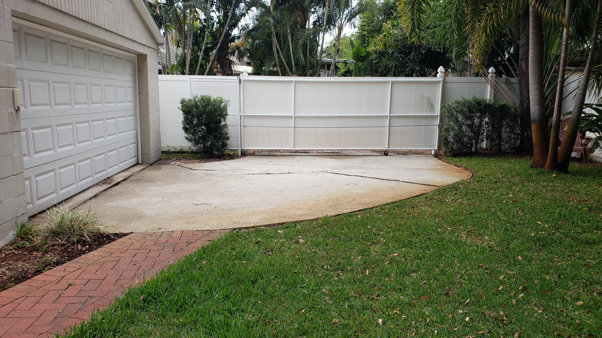

# jenkins

**bold**
*italics*
1. one
2. two
3. three
- first
- second
- third
`code`
[google](https://www.google.com)

| Syntax | Description |
| -------- | ------------ |
| Header | Title |
| Paragraph | Text |

...

